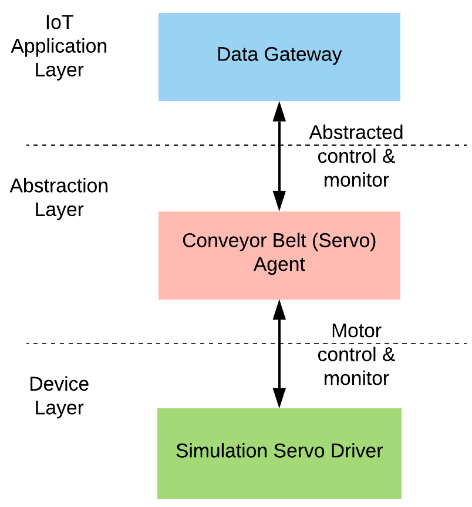

Servo Motor (Conveyor Belt) Simulation on ROS
============

by Orhan Can Görür (cangorur88@gmail.com), Xin Yu (marvelous.islander@gmail.com), Oguz Ozdemir

The goal of this project is:
1. To simulate a digital twin for a servo motor (with adjustable load and motor parameters)
2. To control and monitor the twin model and run it as a ROS agent
3. To interface the system for several IoT and ML applications (e.g., predictive maintenance, adaptive control)

Below are the instructions to successfully install and run the ROS package for the servo motor control applications. We have developed a customizable servo motor simulation based on a Matlab DC Motor control example and tailored it to act as a digital twin model of a Dynamixel XL430-W250-T servo motor from Robotis [1]. Our goal is to simulate a real (small-scale) conveyor belt behavior for our industrial IoT project (i.e., CHARIOT [2]) that runs predictive maintenance applications [3]. This project involves just the simulated conveyor belt (servo motor).

The system runs on ROS and provides many services and topics for an easy access. It is possible to run multiple conveyor belt simulations in parallel, each has a separate interface with unique motor IDs and generates a unique behavior. The system builds a driver agent for the servo motor, a device agent that abstracts the motor behaviors, and an IoT gateway that allows for control and monitoring of the abstracted behaviors through a REST interface (see the Architecture figure).

We have defined REST interfaces to control the motor speed and the torque load on the system. Different torque behaviors are made available to simulate problematic motor behaviors like a glitch, excessive load carried, and extra friction on the conveyor system etc. We mainly used it for a predictive maintenance application to predict aforementioned abnormal behaviors on production lines, when running on an IIoT framework. However, this project is a stand-alone simulation made available for public use.

---

## System Architecture



Simply, on the device layer there is `simulation_servo_agent` that runs the simulated Matlab model on ROS and enables the access to the device (providing raw data and many other control interfaces). On the agent layer, we have developed `conveyor_belt_agent` that abstracts the device behaviors for a more easy interface to the device. We have selected the control behaviors to manipulate the speed of the system and torque load, and give access to current, input power, input voltage, internal temperature (this is still not fully implemented yet) and acceleration. Finally, we have the communication layer running `conveyor_gateway` agent that enables access to the agent layer services through a REST interface for its IoT connection. That bridges the ROS environment through a websocket connection.

---

## Prerequisites
- ROS
- tmux (`sudo apt install tmux`)

The code is tested with ROS Kinetic running on Ubuntu 16.04. It should theoretically be possible to run it on later versions of ROS, but this is not tested.
No special ROS packages are needed apart from those which come with a standard installation of ROS.
Tmux installation is required only for the automated launch scripts

---

## Installation:

`TODO: fix the CMakeLists.txt file`

Since the project is built on ROS, building with ROS is sufficient.
```
cd conveyor_belt_simulation
catkin_make
```

---

## Running

`TODO: remove all the others except simulation runs and the scripts`

`TODO: make the IP of the gateway and the port parametric`

```
run_conveyor_simu --conveyors 3 --gateway  

# This example command will launch 3 separate conveyor belt nodes driven by 3 servo motors. It also enables a gateway for each agent for their IoT connection: Enabling control and monitor via websocket.
# type help to also print the options
```
Run options:
- [--conveyors]: If provided, followed by an integer number, it automatically launches that number of conveyor belts in parallel. Not recommended to launch more than 3 (gets heavy). If not provided, by default it is 1.

- [--gateway]: If provided, it runs gateways for each of the conveyor launched. The gateway starts a websocket to communicate with the devices also from outside of ROS environment. By default, it DOES NOT run any gateway.

- [--help]: Type help to see the options

This will launch the following:
 - simulation_servo_agent_<ID>: Simulated motor running on ROS framework with an integer ID (if 3 motors are running, then the IDs are 1, 2, and 3).
 - conveyor_belt_agent_<ID>: ROS agent that abstracts the behaviors of the servo motor (abstraction layer)
 - (optional) conveyor_gateway_<ID>: Gateway agent that allows access to the abstracted behavior through a REST interface

### Operational Runs

There are several control and monitoring options to interface the conveyor systems:

Now for sending motor control commands:

*(another terminal)* To drive the motor and add several different torque requests (to create abnormal or normal load behaviors), run the binaries below:

- To set a speed and run:

```
run_motor --id <integer_id> --speed <float_speed in m/s>  

# --id is the integer ID of the motor running (e.g., if 2 motors are run, their IDs are `1` and `2`).
# if no speed info provided, it runs with 25 m/s by default.
```

- To generate an abnormal torque:

```
generate_torque --id <integer_id> --enable

# This generates a ramp torque (a linear increase) on motor-1 (if ID not provided, it is 1 by default) for 100 secs on the load --> increase in the drained current and the power
```
Please see the services section ([here](#services)) to generate different load behaviors, e.g., sinusoidal, step, using ROS services.

- To remove any existing torque:

```
generate_torque  --id <integer_id> --disable

# This removes the torque immediately. The power values should get back to normal.  
```

- To access to the motor readings, we provide two options. You can either directly read from ROS topics or through the REST interface (see the next section). To read from topics:

```
rostopic echo /conveyor_belt_agent_<ID>/motor_data_operated

# This will output a ROS message type with the following variables:
---
timestamp: 5.359
requested_velocity: 20.0
velocity: 19.923
temperature: 50.0
torque: -0.000229848913569
current: 0.184444063764
effective_voltage: 4.59051891744
power_in: 0.846693963919
acceleration: -0.763333333336
---
```

- For applications, a simple plot python script is also provided that takes ID of the motor as input and plots velocity, current, power graphs and records the real-time data into a .csv file automatically.

```
cd src/dobot/src
python motor_plot.py <integer_motor_id> # e.g., python motor_plot.py 2
```

### REST Interface (Control & Monitor)

JSON templates for the message format and an easy messaging script for tests are provided under [here](./src/dobot/test_websocket/). Please refer to the readme file for message format and details.

In summary, we have one data model for both requests and responses. There are two types of control requests. One is to change the speed and the other is to add load on the motor (see generate_torque command above and relevant services below). Another request is a read request to read the current motor parameters (e.g., current, power, speed, etc). See the services and topics below for details.


### Customize Motor Properties
The simulated motor is a digital twin for Dynamixel XL430-W250-T servo motor. We modelled the motor in Matlab Simulink environment and converted it to a ROS agent. To change the motor parameters and behaviors please refer to the Readme file under [here](./src/dobot/src/simulation_motor_matlab/README.md).

---

## Services

### List of Services
```
/conveyor_belt_agent_<integer ID of the simulation motor>/generateAbnormalTorqueSimMid
/conveyor_belt_agent_<integer ID of the simulation motor>/generateNormalTorqueSimMid
/conveyor_belt_agent_<integer ID of the simulation motor>/setMotorSpeedSimMid
```
*TODO*: HERE
***Conveyor control services***:
```
# Adjust the running speed of the motor during the regular operation:
rosservice call /conveyor_control_app/InOprConveyorControl "isEnabled: 1
speed: 35.0"

# Adjust the speed of the motor for testing purposes (this overwrites the operation):
rosservice call /conveyor_control_app/TestConveyorControl "isEnabled: 1
speed: 35.0"

# Generate normal behaviour (add a certain torque as a normal behaviour) on the conveyor
rosservice call /conveyor_control_app/generateNormalBehavior "isEnabled: true
index: 1
torque: 0.2"

# Generate abnormal behaviour (add extra torque as abnormal behaviour) on the conveyer
rosservice call /conveyor_control_app/generateAbnormalBehavior "{isEnabled: true, index: 1, type: 'sin', param1: 0.2, param2: 50.0, holdTime: 100.0}"
```
Explanation for the abnormal behaviour generation service:
1.  How it works: when service is called, a starting time is set, the service calculate the extra torque changing with the time difference $`T = f(\Delta t)`$.
    Note that this service only works for simulation motors. And the generated torque direction always has the opposite direction as the speed.
2.  index: simulation motor index, should be >= 1
3.  type: extra torque type; could be 'log', 'exp', 'lin', 'step' and 'ramp'.
4.  param1, param2: params used in the extra torque calculation, see 5.
5.  type explanations:
    * log: $`log(a\Delta t+b)`$;
    * exp: $`exp(a\Delta t)+b`$;
    * lin: $`a\Delta t+b`$;
    * step: $`\Delta t`$;
    * ramp: $`a\Delta t`$.
    \
    Note that a, b are param1 and param2; $`\Delta t`$ is time difference.
6.  holdTime: the extra torque becomes unchanged after this holdTime.


### Service examples for motor simulations (Middleware layer)
- First, we need to enable and run each simulation motor:
```
# Run the simulation motors
rosservice call /conveyor_belt_agent_<integer ID of the simulation motor>/setMotorSpeedRealMid "isEnabled: true
speed: 25.0"
```

- To create different modes of operation, including abnormal torque/load case, follow the steps below:
```
# Simulate normal behaviour: adding a constant torque to the conveyor belt.
rosservice call /conveyor_belt_agent_<integer ID of the simulation motor>/generateNormalTorqueSimMid "isEnabled: true
torque: 0.2"

# Simulate abnormal behaviour: extra torque adding to the conveyor belt.
rosservice call /conveyor_belt_agent_<integer ID of the simulation motor>/generateAbnormalTorqueSimMid "{isEnabled: true, type: 'log', param1: 0.1, param2: 1.0, holdTime: 3.0}"
```
Note that the service definitions of generateNormalTorqueSimMid and generateAbnormalTorqueSimMid are the same as the services generateNormalBehavior and generateAbnormalBehavior defined in application layer.
For detailed explanations please refer to the previous part.

## Topics
***Application layer***:
```
/conveyor_control_app/task_app
```
***Middleware layer***:
```
/conveyor_belt_agent_<integer ID of the real motor>/infrared_app
/conveyor_belt_agent_<integer ID of the real motor>/motor_data_operated
/conveyor_belt_agent_<integer ID of the simulation motor>/abnormal_torque
/conveyor_belt_agent_<integer ID of the simulation motor>/infrared_app
/conveyor_belt_agent_<integer ID of the simulation motor>/motor_data_operated
```

## Documentation
```
rosdoc_lite YOUR_PATH/servo_motor_simulation/src/dobot
```
This will generate the doxygen style documentation under doc/ in YOUR_PATH/dobot_ws/src/dobot.

## Historical Versions
Integration Version 3.1 - 19th Nov 2018
Document Version 3.4 - 17th Feb 2020 (simplified version for only simulation)
Document Version 3.3 - 17th Dec 2018
Document Version 3.2 - 26th Nov 2018

## References
[1] http://www.robotis.us/dynamixel-xl430-w250-t/
[2] https://chariot.gt-arc.com/
[3] https://github.com/GT-ARC/chariot-ml-engine
